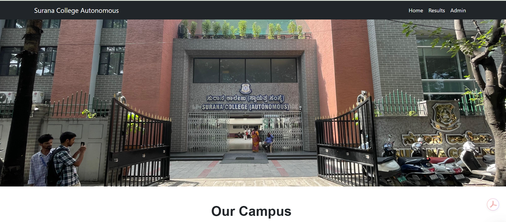
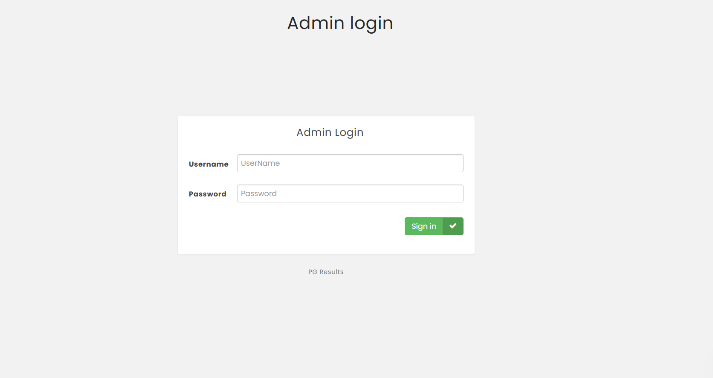
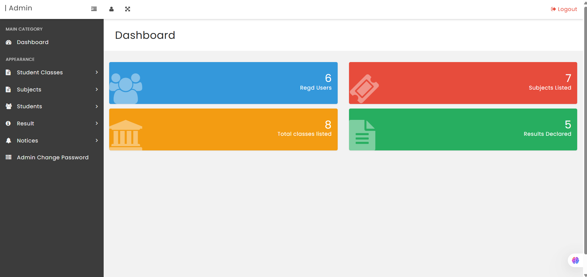
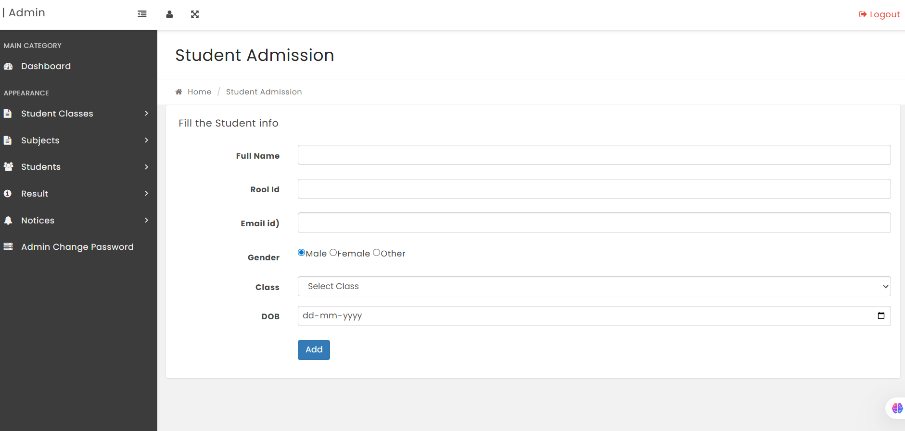
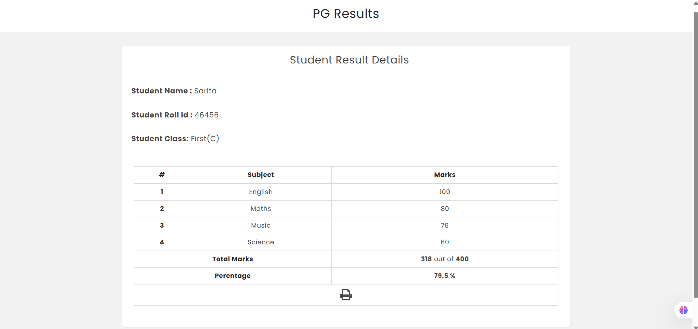

<h1 align="center">🎓 Student Result Management System (SRMS)</h1>

<p align="center">
  
</p>

<p align="center">
  <b>A complete web-based academic result management platform built using PHP & MySQL.</b>
</p>

---

## 📖 About The Project

The **Student Result Management System (SRMS)** is a web-based application designed to manage student academic records efficiently.

It allows administrators to:

- Manage student information
- Enter and update marks
- Automatically calculate grades & percentages
- Display results securely

Built using:

- HTML5
- CSS3
- JavaScript
- PHP
- MySQL

---

## 🖼️ Project Screenshots

### 🔐 Admin Login
<p align="center">
  
</p>

### 📊 Admin Dashboard
<p align="center">
  
</p>

### 📝 Add Student
<p align="center">
  
</p>

### 📄 Student Result
<p align="center">
  
</p>

## 🚀 Features

- ✅ Secure Admin Authentication
- ✅ Add / Edit / Delete Students
- ✅ Manage Subjects & Classes
- ✅ Enter Marks Subject-wise
- ✅ Automatic Total & Percentage Calculation
- ✅ Grade Generation System
- ✅ Student Result Search by Roll Number
- ✅ Responsive User Interface
- ✅ MySQL Database Integration

---

## 🏗️ Project Structure

```
student-result-management-system/
│
├── admin/
│   ├── add-student.php
│   ├── manage-results.php
│   ├── dashboard.php
│   └── ...
│
├── includes/
│   ├── config.php
│   ├── dbconnect.php
│   ├── session.php
│
├── assets/
│   ├── css/
│   ├── js/
│   └── images/
│
├── database/
│   └── srms_db.sql
│
├── index.php
├── result.php
└── README.md
```

---

## 🛠️ Technologies Used

| Technology | Purpose |
|------------|----------|
| HTML5 | Frontend Structure |
| CSS3 | Styling & Layout |
| JavaScript | Dynamic Interactions |
| PHP | Backend Logic |
| MySQL | Database Storage |
| XAMPP / WAMP | Local Server Environment |

---

## ⚙️ How It Works

1️⃣ Admin logs in securely  
2️⃣ Admin adds students & subjects  
3️⃣ Admin enters subject-wise marks  
4️⃣ System automatically calculates total, percentage & grade  
5️⃣ Students search results using roll number  

---

## 🔧 Installation Guide

### 📌 Requirements
- XAMPP / WAMP / LAMP Installed
- Apache & MySQL Services Running

### 🛠 Setup Steps

1. Clone the repository:

```bash
git clone https://github.com/pradeep-bhat-ms/Student-Result-Managemet-System.git
```

2. Move project folder to:

```
C:\xampp\htdocs\
```

3. Open **phpMyAdmin**
4. Create database:

```
srms_db
```

5. Import SQL file from:

```
database/srms_db.sql
```

6. Start Apache & MySQL

7. Visit in browser:

```
http://localhost/Student-Result-Managemet-System
```

---

## 🔐 Default Admin Credentials

```
Username: admin
Password: admin
```

---

## 🌟 Future Enhancements

- 📊 Result Analytics Dashboard (Charts)
- 📄 PDF Marksheet Export
- 📩 Email/SMS Notification System
- 🔐 Student Login Portal
- 🤖 AI-Based Performance Analysis

---

## 👨‍💻 Author

**Pradeep Bhat M S**  
MCA (AI & ML) – 2025  
Full Stack Developer  

GitHub: https://github.com/pradeep-bhat-ms  
LinkedIn: https://www.linkedin.com/in/pradeep-bhat-66ba752b9  

---

## 📜 License

This project is open-source and available under the MIT License.
